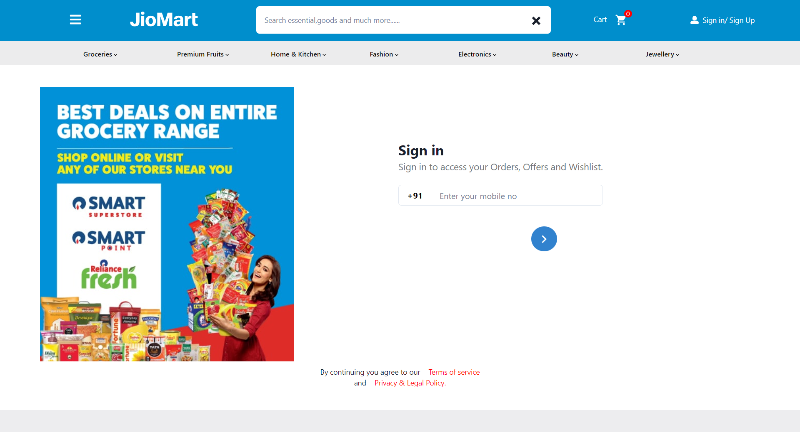
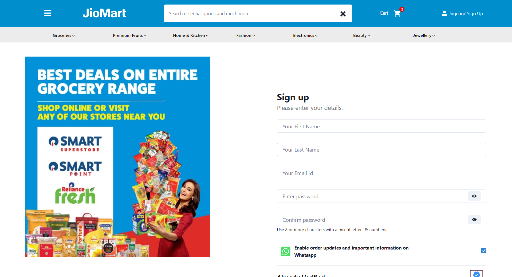
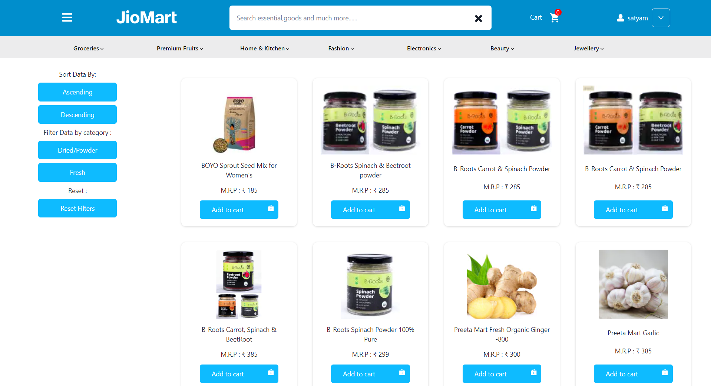
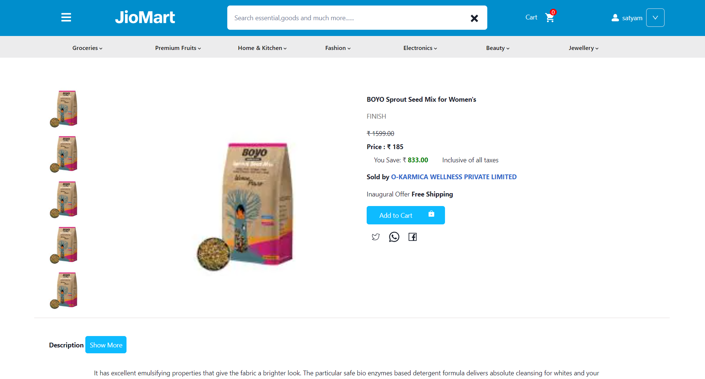
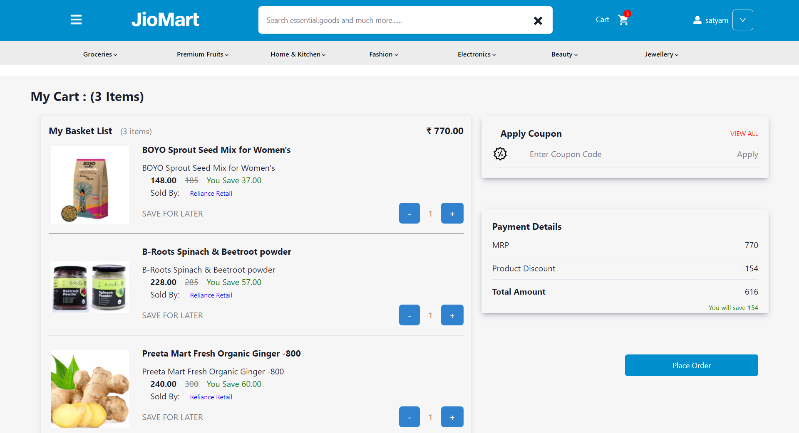
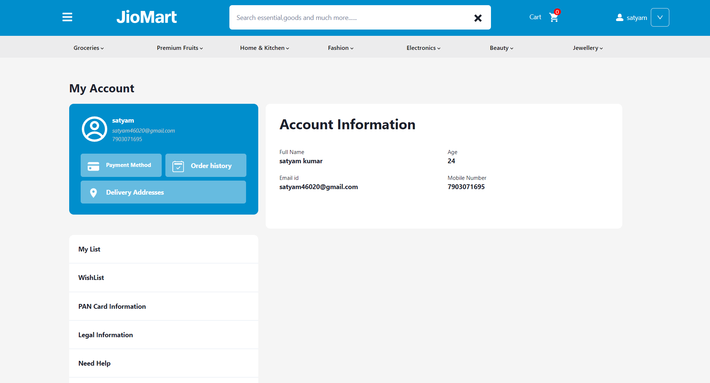

<h1 align="center" id="title">Jio Mart</h1>
Jio Mart is a clone of Jiomart.com. Jio Mart is India's most convenient online grocery channel. No more hassles of sweating it out in crowded markets, grocery shops & supermarkets - now shop from the comfort of your home, office or on the move.

##  

This project was built during our construct week at Masai School. It was built by a team of 6 developers and executed in 6 days.
       
## 🚀 Demo

*Front-end deployed URL:*

## Presentation Video

https://drive.google.com/file/d/1CvqJYCjHZGaIMumc6OYKy9TJ9S913F3H/view?usp=sharing

## GitHub Repoitory Link

https://github.com/sachin2398/jio-mart

## ✍ Contributors

- [@Sachin](https://github.com/sachin2398)
- [@Satyam](https://github.com/satyam46020)
- [@Shashikant](https://github.com/shashikantRupin)
- [@Arti](https://github.com/artisonii)
- [@Mrinal](http://Github.com/Mrinal26)
- [@Sunil](https://github.com/Sunil8090)
## 🛠 Built with 

Technologies used in the project:

## 💻 Screenshots

*Home Page:*

*Sign Up Page*

*Login Page:*

*Product Page:*

*Single Product Page:*

*Cart Page:*

*My Account Page*

## ✨ Features 

- Responsive
- Private Routing
- Search Funtionality
- Filter and Sorting
- Custom Components
- Crausels
- Form Validation (Login,Signup)

## Pages

- Home Page
- Login/Logout Page
- Sign Up Page
- Admin Panel 
- Product Page
    - Beverages
    - Electronic Products
    - Fruits and Vegetables
- Cart Page
- My Account
- Checkout Page
- Payment Page

## 🚀 Demo

*Front-end deployed URL:*

##  📁 Folder structure
- #### public - This holds all of our static files
- #### src
    - #### assets - This folder holds assets such as images, docs, and fonts
    - #### components - This folder holds all of the different components that will make up our pages
    - #### pages - These represent a unique page on the website i.e. Home or About. 
    - #### redux - It consists of store, reducer, action and actiontypes and is responsible for global state management of our app.
    - #### App.js - This is what renders all of our browser routes and different pages
    - #### index.js - This is what renders the react app by rendering App.js.
- #### package.json - Defines npm behaviors and packages for the client

#### .gitignore - Tells git which files to ignore
#### README - This file!

